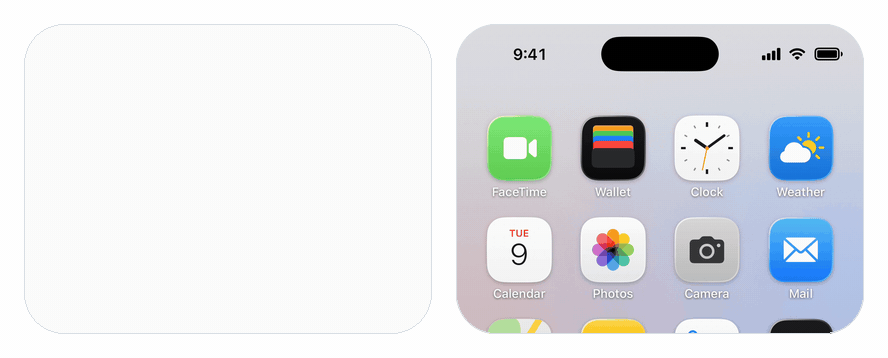
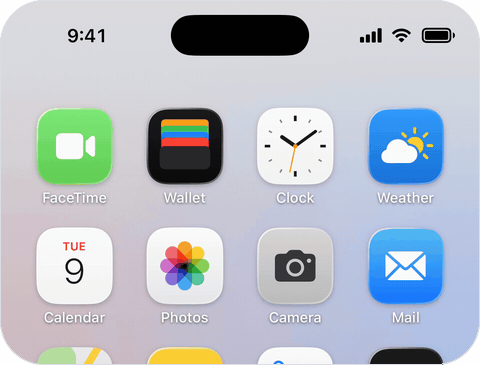
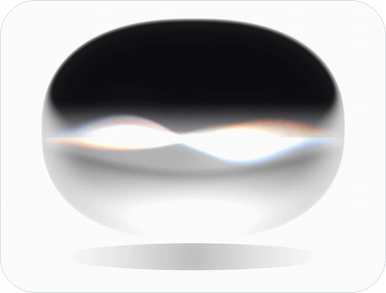

<p align="center">
  <picture>
    <source media="(prefers-color-scheme: dark)" srcset="assets/banner-dark.gif">
    
  </picture>
</p>

<h1 align="center">SiriGlass</h1>

<p align="center">
  The Siri drop from iOS 27, for your own app.<br />
  Liquid Glass that pours out of the Dynamic Island, listens, and lights up with your voice.
</p>

<p align="center">
  
  
  
  
  
</p>

---

```swift
.siriGlass($siri)
```

That is the whole integration. Set `siri` to `.listening` and a drop of glass drips out of the Dynamic Island, hangs there, and lights up with the microphone: loud words swell the light, vowels and consonants move different strands of it. A beat after you stop talking it gathers itself up and thinks. Set it back to `.idle` and it slips home. The glass is the system's own Liquid Glass, so whatever your app shows underneath bends through it, live.

**[Download the demo video, with sound (MP4)](assets/demo.mp4)**

## Installation

In Xcode: **File > Add Package Dependencies** and paste

```
https://github.com/haplollc/SiriGlass
```

Or in `Package.swift`:

```swift
dependencies: [
    .package(url: "https://github.com/haplollc/SiriGlass", from: "1.0.0")
]
```

Then add `SiriGlass` to your target's dependencies, and give your app's Info.plist an `NSMicrophoneUsageDescription`. The drop asks for the microphone the first time it listens.

## Quick start

```swift
import SwiftUI
import SiriGlass

struct ContentView: View {
    @State private var siri = SiriGlassState.idle

    var body: some View {
        NavigationStack {
            InboxView()
                .toolbar {
                    Button("Ask", systemImage: "waveform") {
                        siri = siri == .idle ? .listening : .idle
                    }
                }
        }
        .siriGlass($siri)
    }
}
```

## Two ways to show it

| Under the Dynamic Island | On its own |
|:---:|:---:|
| <picture><source media="(prefers-color-scheme: dark)" srcset="assets/island-dark.gif"></picture> | <picture><source media="(prefers-color-scheme: dark)" srcset="assets/orb-dark.gif"></picture> |
| `.siriGlass($siri)` | `SiriGlassOrb(state: $siri)` |
| Pours out of the island over any view, wherever that view sits in the window. | Blooms from the middle of whatever frame you give it, keeping the drop's 4:3 shape. |

```swift
SiriGlassOrb(state: $siri)
    .frame(width: 320, height: 240)
    .onTapGesture { siri = siri == .idle ? .listening : .idle }
```

On a light backdrop the orb darkens its rim and casts a soft shadow below itself, outside its frame. Idle, it draws nothing.

## States

`SiriGlassState` is everything the drop does:

| State | What you see |
|---|---|
| `.idle` | Home. The drop pulls back into the island with a small swell, then draws nothing and costs nothing. |
| `.listening` | Out, with the light dancing to the audio. |
| `.thinking` | The light gathers into one lens and swirls slowly until you change the state. |

Listening to the microphone or a file, the drop behaves like Siri and writes its decisions back to your binding:

- After at least half a second of speech, 1.4 seconds of quiet moves it to `.thinking`. Listening never runs past 30 seconds.
- If nobody says anything for 14 seconds, it goes back to `.idle`.

From `.thinking` on, the next move is yours. That makes `.thinking` the place to hand off to your model:

```swift
.siriGlass($siri)
.onChange(of: siri) { _, state in
    guard state == .thinking else { return }
    Task {
        reply = await assistant.respond(to: transcript)
        siri = .idle
    }
}
```

## What it listens to

```swift
.siriGlass($siri)                                      // the microphone (the default)
.siriGlass($siri, audio: .file(url))                   // a recording, played aloud
.siriGlass($siri, audio: .file(url, muted: true))      // reacts to it silently
.siriGlass($siri, audio: .feed(voice))                 // audio you already have
```

**The microphone.** While it listens, the drop sets the shared audio session to play-and-record, mixing with other audio and leaving Bluetooth playback where it is, and puts the session back when it stops. Without `NSMicrophoneUsageDescription` it doesn't ask (iOS would end the app) and hears silence.

**A file.** Analysed ahead of time and played from the moment the drop starts listening. Any file `AVAudioFile` can read. Handy for previews, onboarding and UI tests.

**A feed.** If your app already runs an `AVAudioEngine`, for speech recognition say, send the drop the same buffers instead of opening the microphone twice:

```swift
@State private var voice = SiriGlassAudio.Feed()

// In your input tap, on any thread:
voice.send(buffer)
```

Or send levels you measured yourself, about 30 times a second:

```swift
voice.send(SiriGlassLevels(loudness: meter.level))
voice.send(SiriGlassLevels(loudness: 0.8, low: 0.9, mid: 0.6, high: 0.3))
```

With a feed the drop never changes its state by itself. You decide when listening is over.

## Recipes

**Speech recognition and the drop, from one microphone tap:**

```swift
let input = engine.inputNode
input.installTap(onBus: 0, bufferSize: 1024, format: input.outputFormat(forBus: 0)) { buffer, _ in
    request.append(buffer)   // SFSpeechAudioBufferRecognitionRequest
    voice.send(buffer)       // SiriGlassAudio.Feed
}
```

**Let the answer glow too.** Tap whatever plays your assistant's reply and keep the drop listening to it:

```swift
engine.mainMixerNode.installTap(onBus: 0, bufferSize: 1024, format: nil) { buffer, _ in
    voice.send(buffer)
}
```

**A preview that talks:**

```swift
#Preview {
    HomeView()
        .siriGlass(.constant(.listening), audio: .file(Bundle.main.url(forResource: "hello", withExtension: "m4a")!))
}
```

**Hold to talk:**

```swift
Image(systemName: "mic.fill")
    .onLongPressGesture(minimumDuration: 0.2) {
    } onPressingChanged: { pressing in
        siri = pressing ? .listening : .thinking
    }
```

**An assistant card:**

```swift
VStack(spacing: 16) {
    SiriGlassOrb(state: siri)
        .frame(width: 200, height: 150)
    Text(siri == .thinking ? "Thinking…" : "Listening…")
        .font(.headline)
}
.padding(32)
.background(.background, in: .rect(cornerRadius: 28))
```

## How it works

- **The glass** is the system's Liquid Glass, `glassEffect(.clear)` in the drop's outline, rebuilt every frame as the drop stretches. It bends whatever is behind it, SwiftUI or UIKit, live. Before iOS 26 a thin material stands in.
- **The ink and light** are one Metal shader laid over the glass as a `colorEffect`: three strands of light inside a dark ink, each driven by a different part of the voice.
- **The voice** is measured against the loudest speech heard lately rather than a fixed level, so a quiet voice across the room and a loud one up close both fill the drop, and room noise under a gate leaves it calm. Three bands (80–400 Hz, 400 Hz–2 kHz, 2–6 kHz) drive the three strands: vowels sway the widest, consonants flick the narrowest.
- **One clock.** Shape, light and voice are all functions of one clock, so a take can be slowed down for recording and come out identical. The demo video was made that way.
- **Idle is free.** Once the drop is home and still, its timeline stops ticking.
- **It's an overlay.** Nothing behind it is re-rendered or flattened, so lists, maps, text fields and video keep working underneath. It takes no touches.

## Layout

Apply `.siriGlass` to a view that reaches the top of the screen, such as your root view. The drop is placed in window coordinates at the Dynamic Island, so a view lower down still shows it at the top, unless something clips it on the way (a sheet, a scroll view). On a phone without an island it pours from the top centre of the screen.

## Accessibility

The drop is decorative, so VoiceOver skips it. Say what's happening in your own interface, for example with the label of the button that summons it, or an announcement:

```swift
AccessibilityNotification.Announcement("Listening").post()
```

## Requirements

- iOS 17+. The drop's glass is Liquid Glass on iOS 26 and later, and a thin material before.
- Swift 6, Xcode 26+.

## Development

```bash
xcodebuild test -scheme SiriGlass -destination "platform=iOS Simulator,name=iPhone 17 Pro"
open Demo/SiriGlassDemo.xcodeproj    # Orb | iPhone, tap anywhere to talk

# The demo's UI tests, with a synthesized voice that stays silent for its first five seconds:
python3 Scripts/voice.py build/voice-test.wav --lead 5
TEST_RUNNER_SIRI_VOICE=$PWD/build/voice-test.wav xcodebuild test -project Demo/SiriGlassDemo.xcodeproj \
    -scheme SiriGlassDemo -destination "platform=iOS Simulator,name=iPhone 17 Pro" -parallel-testing-enabled NO
```

The unit tests cover the voice analysis and the levels a feed accepts, and compile every snippet in this README against the package. The demo app's UI tests run it end to end on an iPhone simulator, with a synthesized voice standing in for the microphone. They check that the drop stays calm before anyone speaks, swells with the voice, stops listening and slips home once the talking stops, and moves between the orb and the island with the picker. They also check that a tap passes straight through the drop to the screen beneath.

The media in this README are recorded from the demo with the scripts in `Scripts/`:
- `voice.py` makes the voice.
- `record.sh` records a slowed-down take on a simulator.
- `sync.py` and `retime.py` rebuild it at 60 fps from the clock stamped in its corner.
- `mix.py` lays the voice and glass chimes under the video.
- `media.py` cuts the GIFs.

## Trademarks

Siri, Dynamic Island and Liquid Glass are trademarks of Apple Inc. SiriGlass is an independent recreation of how Siri looks in iOS 27. It is not affiliated with, sponsored or endorsed by Apple.

## License

SiriGlass is available under the [MIT license](LICENSE).

Made by [Haplo LLC](https://haploapp.com).
